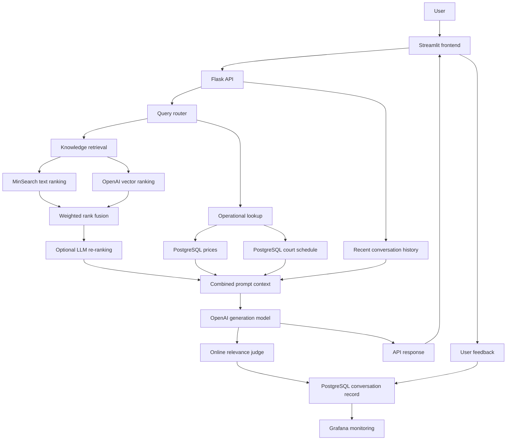

# 🏸 Badminton Mate

[](https://www.python.org/)
[](docker-compose.yaml)
[](frontend.py)
[](docker-compose.yaml)
[](grafana/dashboard.json)
[](tests/)
[](https://frontend-production-22a43.up.railway.app/)

**Live demo:** [Open Badminton Mate on Railway](https://frontend-production-22a43.up.railway.app/)

A RAG-powered assistant for badminton-club information, pricing, schedules, and court availability.

Badminton Mate combines an evaluated knowledge-retrieval pipeline with operational PostgreSQL data. Users can ask natural-language questions through a Streamlit interface or Flask API, submit feedback, and view application metrics in Grafana.

This project was created as an **LLM Zoomcamp final project** and applies the retrieval, evaluation, monitoring, and deployment methods taught by DataTalksClub. The documentation below is written so the project can be understood and run without taking the course.

**Jump to:** [Problem](#problem-description) · [Demo](#try-the-app) · [Architecture](#architecture) · [Evaluation](#evaluation) · [Rubric evidence](#evaluation-criteria-and-rubric-evidence) · [Docker setup](#quick-start-with-docker-compose) · [Tests](#tests) · [Monitoring](#grafana-monitoring) · [Deployment](#railway-deployment)

## Problem description

Badminton facilities often store information across schedules, price lists, policy documents, booking records, and staff knowledge.

Club staff repeatedly need to:

- explain lesson and equipment prices;
- check court schedules;
- answer questions about coaches and skill levels;
- explain cancellation and facility policies;
- find suitable programs;
- respond to repeated customer questions.

This creates slow response times, inconsistent answers, and unnecessary administrative work.

Badminton Mate provides one conversational interface for both static club knowledge and operational schedule data.

Example questions include:

- What should I bring to a badminton session?
- Which coach is suitable for a beginner?
- How much is a one-to-two private lesson?
- What is the cancellation policy?
- What court times are available next Thursday?
- Can I rent a racket at the club?
- Are there beginner group classes?

## Current capabilities

- Streamlit chat interface
- Flask REST API
- Static badminton-club knowledge base
- MinSearch text retrieval
- OpenAI embedding-based vector retrieval
- Evaluated text, vector, and hybrid retrieval configurations
- Weighted rank fusion
- Optional LLM document re-ranking
- Conversation-history-aware retrieval
- Query routing for conversation, knowledge, pricing, schedule, and availability
- Relative-date resolution such as `tomorrow` and `next Thursday`
- PostgreSQL-backed pricing and court schedules
- Eight courts with 60-minute availability slots
- Online LLM relevance evaluation
- Offline retrieval and RAG evaluation
- Conversation and feedback persistence
- Grafana monitoring dashboard
- Docker Compose support
- Railway deployment configuration
- Automated API and ingestion tests

Badminton Mate can check operational availability, but it cannot yet create, modify, or cancel real bookings.

## Try the app

The deployed Streamlit interface is available at:

**https://frontend-production-22a43.up.railway.app/**

The sidebar reports whether the API is connected. Try one question from each data path:

| Use case | Example question | Data path |
| --- | --- | --- |
| Static club knowledge | `What should I bring to a badminton session?` | Evaluated RAG retrieval over `knowledge_base.csv` |
| Current pricing | `How much is a bottle of water?` | Query router → PostgreSQL price catalog |
| Coach schedule | `When does Coach Amy have classes next week?` | Query router → date range → PostgreSQL schedule |
| Court availability | `What court times are available next Thursday?` | Query router → relative date → live availability calculation |

Expected behavior:

- factual claims are grounded in retrieved documents or operational database rows;
- static knowledge is never presented as live availability;
- schedule answers distinguish occupied activities from bookable court times;
- prices and availability come from PostgreSQL rather than being invented by the model;
- every API response includes sources, routing metadata, token usage, latency, and an online relevance result.

### Screenshots and preview video

The Mermaid diagrams and technology badges in this README are version-controlled visuals. For release screenshots, capture the deployed Streamlit chat and the Grafana dashboard after both are populated with demonstration data, then save them as:

```text
docs/images/streamlit-chat.png
docs/images/grafana-dashboard.png
```

A short Streamlit preview can be recorded from the app menu and uploaded through GitHub's README editor. Real captures are preferred over mocked screenshots so the documentation stays verifiable.

## Architecture



### Request flow

1. The user submits a question through Streamlit or the Flask API.
2. The frontend includes up to eight recent conversation messages.
3. The query router identifies conversation, knowledge, pricing, schedule, or availability intent.
4. Relative dates are resolved when operational data is requested.
5. Knowledge queries use the selected text, vector, or hybrid configuration.
6. Retrieved documents may be re-ranked by an LLM.
7. Pricing and schedule questions query PostgreSQL.
8. Retrieved documents, operational results, and conversation history are combined in the prompt.
9. The generation model produces a grounded answer.
10. An online judge evaluates the response.
11. The conversation, sources, routing details, token usage, timing, and evaluation are saved.
12. Users may submit positive or negative feedback.
13. Grafana reads the stored monitoring data.

## Technology stack

| Component | Technology |
| --- | --- |
| Language | Python 3.12+ |
| Web interface | Streamlit |
| API | Flask |
| Generation and evaluation | OpenAI API |
| Text retrieval | MinSearch |
| Vector retrieval | OpenAI embeddings and NumPy |
| Rank fusion | Weighted reciprocal-rank fusion |
| Re-ranking | Structured LLM re-ranking |
| Data processing | Pandas |
| Operational database | PostgreSQL 16 |
| Monitoring | Grafana |
| Testing | pytest |
| Dependencies | uv, `pyproject.toml`, and `uv.lock` |
| Containerization | Docker and Docker Compose |
| Cloud deployment | Railway |

## Project structure

```text
Tonyweng-AI-agent-Project/
|-- app.py
|-- frontend.py
|-- courtmate/
|   |-- config.py
|   |-- db.py
|   |-- hybrid_search.py
|   |-- ingest.py
|   |-- live_context.py
|   |-- operations.py
|   |-- query_router.py
|   |-- rag.py
|   |-- source_selection.py
|   `-- rerank.py
|-- evaluation/
|   |-- evaluate_retrieval.py
|   |-- evaluate_hybrid.py
|   |-- evaluate_reranking.py
|   |-- evaluate_rag.py
|   `-- evaluate_operational.py
|-- scripts/
|   |-- db_prep.py
|   |-- seed_operational_data.py
|   `-- check_operational_search.py
|-- tests/
|   |-- conftest.py
|   |-- test_api.py
|   |-- test_ingest.py
|   |-- test_live_context.py
|   |-- test_query_router.py
|   `-- test_source_selection.py
|-- data/
|   |-- knowledge_base.csv
|   |-- ground-truth-retrieval.csv
|   |-- ground-truth-operational.json
|   |-- best-minsearch-boost.json
|   |-- best-retrieval-config.json
|   |-- best-reranking-config.json
|   `-- evaluation/
|       |-- retrieval-evaluation-results.csv
|       |-- hybrid-retrieval-evaluation-results.csv
|       |-- reranking-evaluation-results.csv
|       |-- rag-evaluation-baseline.csv
|       |-- rag-evaluation-comparison.csv
|       |-- rag-prompt-comparison.csv
|       `-- operational-rag-evaluation-results.csv
|-- grafana/
|   |-- init.py
|   `-- dashboard.json
|-- notebooks/
|-- Dockerfile
|-- docker-compose.yaml
|-- pyproject.toml
|-- uv.lock
|-- .python-version
|-- .env.example
`-- README.md
```

## Data sources

### Knowledge base

The static knowledge base is stored in:

```text
data/knowledge_base.csv
```

Each document contains:

- `id`
- `category`
- `title`
- `content`
- `coach_name`
- `skill_level`
- `location`

The ingestion code validates required columns and unique document IDs before fitting the search index.

### Operational data

PostgreSQL stores operational records for:

- coaches;
- offerings;
- prices;
- courts;
- court schedules;
- conversations;
- feedback.

The demonstration seed contains:

- eight badminton courts;
- hourly court rental;
- one-to-one, one-to-two, and one-to-three private lessons;
- basic and advanced group classes;
- weekly group-class packages;
- racket and shoe rental;
- soft drinks and bottled water;
- simulated private lessons, classes, bookings, and available slots.

The generated court schedule covers 28 days. Normal public booking slots run from 10:00 AM to 10:00 PM in 60-minute intervals.

This is simulated operational data for demonstration purposes, not an external production booking system.

On startup, seed-managed catalog rows are refreshed, removed seed entries are deactivated, and only `simulation` schedule rows are rebuilt. Manual schedule rows are preserved.

## Retrieval pipeline

### Text retrieval

MinSearch searches the configured text fields and supports evaluated field boosts.

### Vector retrieval

Knowledge-base documents are converted to embeddings with the configured OpenAI embedding model. Query embeddings are compared with normalized document vectors using cosine similarity.

### Hybrid retrieval

The project evaluates:

- text-only retrieval;
- 70% text and 30% vector retrieval;
- 50% text and 50% vector retrieval;
- 30% text and 70% vector retrieval;
- vector-only retrieval.

Text and vector rankings are combined with weighted reciprocal-rank fusion. The best configuration is selected using validation data and saved to:

```text
data/best-retrieval-config.json
```

The held-out test set is used for reporting, not configuration selection.

### Document re-ranking

The project compares retrieval with and without LLM re-ranking. The selected configuration is saved to:

```text
data/best-reranking-config.json
```

The re-ranker returns structured document IDs and relevance scores. Invalid or omitted IDs are handled safely, and omitted candidates retain their original order.

### Query routing

The router distinguishes:

- normal conversation;
- general knowledge;
- pricing;
- coach and activity schedules;
- court availability.

Operational requests can include a normalized query, offering type, coach name, start date, end date, and time range. For schedule and availability questions, the router resolves expressions such as:

```text
tomorrow
next Thursday
August 6
```

Operational results are added to the prompt separately from static knowledge-base context.

## Evaluation

The evaluation design follows the LLM Zoomcamp methodology.

### Ground truth

The retrieval ground truth is stored in:

```text
data/ground-truth-retrieval.csv
```

It contains evaluation questions and expected document IDs. Records are split by document ID to prevent questions from the same document appearing in both validation and held-out test sets.

### Latest committed results

The repository stores the complete row-level outputs under [`data/evaluation/`](data/evaluation/). The current committed summary is:

| Evaluation stage | Selected approach | Validation result | Held-out / final result | Evidence |
| --- | --- | --- | --- | --- |
| MinSearch field boosts | Manual field boosts | Hit Rate@5 **0.824**, MRR@5 **0.698** | Hit Rate@5 **1.000**, MRR@5 **0.896** | [retrieval results](data/evaluation/retrieval-evaluation-results.csv) |
| Text/vector comparison | Vector-only retrieval | Hit Rate@5 **0.980**, MRR@5 **0.881** | Hit Rate@5 **1.000**, MRR@5 **1.000** | [hybrid results](data/evaluation/hybrid-retrieval-evaluation-results.csv) |
| Document re-ranking | LLM re-ranking enabled | Hit Rate@1 **0.941**, MRR@5 **0.961** | Hit Rate@1 **1.000**, MRR@5 **1.000** | [re-ranking results](data/evaluation/reranking-evaluation-results.csv) |
| Prompt comparison | Production Prompt | **61/63 good (96.83%)** | Tied with baseline; production selected by the documented tie-break | [Prompt comparison](data/evaluation/rag-prompt-comparison.csv) |
| Operational RAG | Deterministic checks + LLM judge | **6/6 deterministic checks passed** | 5 good, 0 bad, 1 needs review | [operational results](data/evaluation/operational-rag-evaluation-results.csv) |

These scores describe a small, project-specific evaluation dataset; they are evidence for configuration selection, not a production-service guarantee. Validation data selects configurations. Held-out data is reported afterward and is not used for tuning.

### Retrieval evaluation

Retrieval is evaluated using:

- Hit Rate at K;
- Mean Reciprocal Rank;
- held-out document-level testing.

Run:

```bash
uv run python -m evaluation.evaluate_retrieval
```

This compares multiple MinSearch boost configurations and stores the selected configuration.

### Hybrid evaluation

Run:

```bash
uv run python -m evaluation.evaluate_hybrid
```

This compares text, vector, and weighted hybrid approaches. Results are written to:

```text
data/evaluation/hybrid-retrieval-evaluation-results.csv
```

### Re-ranking evaluation

Run:

```bash
uv run python -m evaluation.evaluate_reranking
```

This compares retrieval with and without LLM re-ranking.

Results are written to:

```text
data/evaluation/reranking-evaluation-results.csv
```

### RAG and Prompt evaluation

Run:

```bash
uv run python -m evaluation.evaluate_rag
```

This compares:

- a baseline Prompt;
- the production Prompt.

An LLM judge compares the question, original knowledge record, retrieved context, and generated answer, then assigns `good` or `bad`. Recording the retrieved context makes it possible to distinguish a retrieval failure from a generation failure.

Results are written to:

```text
data/evaluation/rag-evaluation-comparison.csv
data/evaluation/rag-prompt-comparison.csv
```

The current baseline and production Prompts both score 61/63. The production Prompt is selected by a deterministic tie-break because it includes the project's grounding and operational-safety rules.

### Operational RAG evaluation

Run:

```bash
uv run python -m evaluation.evaluate_operational
```

This evaluation checks live price, coach-schedule, and court-availability questions. It combines deterministic route/context assertions with an LLM judge. Deterministic failures are always failures; disagreements where the route and required database values are correct are marked `needs_review` instead of being silently counted as correct.

### Run all evaluations

Run the stages in this order:

```bash
uv run python -m evaluation.evaluate_retrieval
uv run python -m evaluation.evaluate_hybrid
uv run python -m evaluation.evaluate_reranking
uv run python -m evaluation.evaluate_rag
uv run python -m evaluation.evaluate_operational
```

Hybrid, re-ranking, RAG, and operational evaluation call OpenAI APIs and may incur usage charges. The operational evaluation also requires the seeded PostgreSQL service.

`evaluate_rag` records the question count and SHA-256 fingerprint of the ground-truth file in `rag-prompt-comparison.csv`, making stale Prompt results visible after the dataset changes.

## Evaluation criteria and rubric evidence

This table maps the course rubric directly to repository evidence so reviewers do not need to infer where each requirement is implemented.

| Criterion | Repository evidence | Self-assessment |
| --- | --- | ---: |
| Problem description | [Problem description](#problem-description) explains the user, pain points, and supported questions | **2/2** |
| Retrieval flow | [Architecture](#architecture), [`courtmate/rag.py`](courtmate/rag.py), and [`courtmate/hybrid_search.py`](courtmate/hybrid_search.py) use both a knowledge base and an LLM | **2/2** |
| Retrieval evaluation | MinSearch, weighted hybrid, vector-only, and re-ranking approaches are compared; validation winners are saved and used | **2/2** |
| LLM evaluation | Baseline and production Prompts are compared with an LLM-as-a-Judge; the production Prompt is selected | **2/2** |
| Interface | Streamlit UI plus Flask API | **2/2** |
| Ingestion pipeline | [`courtmate/ingest.py`](courtmate/ingest.py) and Python setup/seed scripts automate loading, but no workflow orchestrator is used | **1/2** |
| Monitoring | User feedback is stored and Grafana provides eight panels | **2/2** |
| Containerization | PostgreSQL, API, Streamlit, and Grafana are all defined in [`docker-compose.yaml`](docker-compose.yaml) | **2/2** |
| Reproducibility | Locked dependencies, accessible data, environment template, Docker setup, tests, and evaluation commands are provided | **2/2** |

**Core self-assessment: 17/18.** Final scoring belongs to the reviewer.

Best-practice evidence:

- **Hybrid search:** multiple text/vector weightings are evaluated.
- **Document re-ranking:** the LLM re-ranker is evaluated and the selected configuration is loaded by the application.
- **User query rewriting:** recent conversation history is used for conversation-aware query expansion before retrieval.
- **Cloud deployment bonus:** the application is deployed on Railway.

## API

### Health check

```http
GET /health
```

Example:

```bash
curl http://localhost:5000/health
```

### Submit a question

```http
POST /question
```

Example knowledge question:

```bash
curl -X POST http://localhost:5000/question \
  -H "Content-Type: application/json" \
  -d '{"question":"What should I bring to a badminton session?"}'
```

Example availability question:

```bash
curl -X POST http://localhost:5000/question \
  -H "Content-Type: application/json" \
  -d '{"question":"What court times are available next Thursday?"}'
```

The endpoint also accepts recent conversation history:

```json
{
  "question": "What about next Thursday?",
  "history": [
    {
      "role": "user",
      "content": "I want to book a court next week."
    }
  ]
}
```

### Submit feedback

```http
POST /feedback
```

Example:

```bash
curl -X POST http://localhost:5000/feedback \
  -H "Content-Type: application/json" \
  -d '{
    "conversation_id": "replace-with-conversation-id",
    "feedback": 1
  }'
```

Feedback values:

```text
 1 = positive
-1 = negative
```

## Environment variables

Copy the example configuration:

```bash
cp .env.example .env
```

Windows PowerShell:

```powershell
Copy-Item .env.example .env
```

The local configuration uses:

```env
OPENAI_API_KEY=replace-with-your-openai-key
OPENAI_MODEL=gpt-4o-mini
OPENAI_JUDGE_MODEL=gpt-4o-mini
OPENAI_EMBEDDING_MODEL=text-embedding-3-small
OPENAI_RERANK_MODEL=gpt-4o-mini
OPENAI_ROUTER_MODEL=gpt-4o-mini

POSTGRES_HOST=localhost
POSTGRES_PORT=5432
POSTGRES_DB=courtmate
POSTGRES_USER=courtmate
POSTGRES_PASSWORD=courtmate
TZ=America/Toronto

GRAFANA_ADMIN_USER=admin
GRAFANA_ADMIN_PASSWORD=admin
GRAFANA_URL=http://localhost:3000
```

Replace the placeholder OpenAI Key in `.env`.

Never commit `.env` or a real API Key. Railway secrets must be configured using Railway service variables.

## Quick start with Docker Compose

### Requirements

- Docker with Docker Compose
- An OpenAI API Key

### Clone and configure

```bash
git clone https://github.com/tonyweng0906/Tonyweng-AI-agent-Project.git
cd Tonyweng-AI-agent-Project
cp .env.example .env
```

Add your OpenAI API Key to `.env`.

### Start all services

```bash
docker compose up -d --build
```

The API container automatically:

1. waits for PostgreSQL;
2. creates the database tables;
3. seeds operational demonstration data;
4. starts the Gunicorn API server.

Check the services:

```bash
docker compose ps
```

### Initialize Grafana

Run the initializer inside the application container:

```bash
docker compose exec \
  -e GRAFANA_URL=http://grafana:3000 \
  app python grafana/init.py
```

This creates or updates the PostgreSQL datasource and imports the version-controlled dashboard.

### Open the services

| Service | Local URL |
| --- | --- |
| Streamlit frontend | `http://localhost:8501` |
| Flask API | `http://localhost:5000` |
| Flask health check | `http://localhost:5000/health` |
| Grafana | `http://localhost:3000` |
| PostgreSQL | `localhost:5432` |

Local Grafana defaults:

```text
Username: admin
Password: admin
```

Change the Grafana administrator password before exposing Grafana publicly.

### View logs

```bash
docker compose logs -f app
docker compose logs -f frontend
docker compose logs -f grafana
docker compose logs -f postgres
```

### Stop the project

```bash
docker compose down
```

This preserves PostgreSQL and Grafana named volumes.

To intentionally erase both data volumes:

```bash
docker compose down -v
```

Do not use `-v` unless you intend to delete all stored local data.

## Local development with uv

Install the locked dependencies:

```bash
uv sync --locked
```

Start PostgreSQL:

```bash
docker compose up -d postgres
```

Prepare and seed the database:

```bash
uv run python -m scripts.db_prep
uv run python -m scripts.seed_operational_data
```

Start the API:

```bash
uv run python app.py
```

In another terminal, start Streamlit:

```bash
uv run streamlit run frontend.py --server.port 8501
```

## Tests

Run the complete test suite:

```bash
uv run pytest tests -v
```

The current suite contains **21 passing tests** covering:

- API health behavior;
- required question validation;
- invalid feedback validation;
- successful mocked RAG responses;
- knowledge-base CSV loading;
- required ingestion columns;
- duplicate document IDs;
- retrieval boost configuration loading;
- deterministic price-query normalization;
- relative weekday and week-range resolution;
- live price and coach-schedule context construction;
- safe supporting-source filtering;
- oversized question rejection.

The API tests mock RAG and database dependencies, so they do not call OpenAI or require a live PostgreSQL connection.

## Grafana monitoring

The dashboard definition is stored in:

```text
grafana/dashboard.json
```

The initializer is stored in:

```text
grafana/init.py
```

The dashboard includes eight panels covering:

- total question volume;
- response relevance;
- response latency;
- token usage;
- positive and negative feedback;
- satisfaction ratio;
- recent conversations.

Grafana reads PostgreSQL through its datasource. In Railway, the datasource should use the PostgreSQL private-network hostname and credentials.

## Railway deployment

The project can be deployed as four Railway services:

- PostgreSQL
- API
- Streamlit frontend
- Grafana

### API service

Required variables include:

```text
OPENAI_API_KEY
OPENAI_MODEL
OPENAI_JUDGE_MODEL
OPENAI_EMBEDDING_MODEL
OPENAI_RERANK_MODEL
OPENAI_ROUTER_MODEL
POSTGRES_HOST
POSTGRES_PORT
POSTGRES_DB
POSTGRES_USER
POSTGRES_PASSWORD
TZ
```

Recommended API start command:

```text
python -m scripts.db_prep && python -m scripts.seed_operational_data && gunicorn --bind 0.0.0.0:$PORT --workers 2 --threads 4 --timeout 180 app:app
```

Use Railway reference variables for PostgreSQL credentials. Do not copy production credentials into the repository.

The API limits request bodies to 64 KiB and questions to 2,000 characters by default. These limits can be adjusted with `MAX_REQUEST_BYTES`, `MAX_QUESTION_LENGTH`, `MAX_HISTORY_MESSAGES`, and `MAX_HISTORY_MESSAGE_LENGTH`.

### Frontend service

Set:

```text
BADMINTON_MATE_API_URL=https://your-api-domain
```

The frontend start command is:

```text
streamlit run frontend.py --server.address=0.0.0.0 --server.port=$PORT
```

### Grafana service

Attach a persistent Railway volume at:

```text
/var/lib/grafana
```

Configure the PostgreSQL datasource with Railway's private database hostname. Import:

```text
grafana/dashboard.json
```

Seal sensitive Railway variables and rotate any credential that has been exposed.

## Troubleshooting

### Frontend cannot reach the API

```bash
docker compose ps
docker compose logs frontend --tail=100
docker compose logs app --tail=100
```

Inside Docker Compose, the frontend URL must be:

```text
BADMINTON_MATE_API_URL=http://app:5000
```

### API cannot connect to PostgreSQL

Inside Docker Compose:

```text
POSTGRES_HOST=postgres
```

Check:

```bash
docker compose logs postgres --tail=100
docker compose logs app --tail=100
```

### Grafana has no datasource or dashboard

Run:

```bash
docker compose exec \
  -e GRAFANA_URL=http://grafana:3000 \
  app python grafana/init.py
```

Then inspect:

```bash
docker compose logs grafana --tail=100
```

### Docker is using an old configuration

```bash
docker compose config
docker compose down --remove-orphans
docker compose up -d --build
```

### A port is already in use

Change only the host side of the relevant mapping.

For example:

```yaml
ports:
  - "5001:5000"
```

The frontend container should continue using:

```text
http://app:5000
```

## Safety and limitations

- Static knowledge-base information must not be presented as live availability.
- Operational availability comes from the PostgreSQL demonstration schedule.
- The assistant cannot currently create, hold, modify, or cancel a booking.
- A booking must never be described as confirmed without a successful booking-system response.
- Prices, policies, schedules, and coach information must not be invented.
- Database-changing actions should require explicit user confirmation.
- Customer information and credentials must not be exposed.
- Production secrets belong in Railway variables, not source control.
- The system provides club information, not a guaranteed booking service.

## Roadmap

### Completed

- Static knowledge-base ingestion
- Text and vector retrieval
- Hybrid retrieval evaluation
- Document re-ranking evaluation
- Prompt comparison
- LLM-as-a-Judge evaluation
- Flask API
- Streamlit interface
- PostgreSQL persistence
- Operational pricing and schedule lookup
- Grafana monitoring
- Docker Compose
- Railway deployment configuration
- API and ingestion tests

### Planned

- Real booking creation
- Conflict-safe cancellation and rescheduling
- Customer and staff authentication
- Role-based permissions
- Coach-specific pricing and availability
- Staff schedule-management interface
- Email or SMS confirmations
- Calendar integration
- GitHub Actions CI
- Database backups and alerts
- Embedding cache
- Multilingual support
- Load and security testing

## References

- [DataTalksClub LLM Zoomcamp](https://github.com/DataTalksClub/llm-zoomcamp)
- Retrieval-Augmented Generation
- Ground-truth retrieval evaluation
- Hit Rate and Mean Reciprocal Rank
- LLM-as-a-Judge
- Hybrid retrieval and document re-ranking

## Author

**Tony Weng**

LLM Zoomcamp Final Project

## License

This repository is currently intended for educational and portfolio purposes. Add a formal license before distributing it as an open-source project.

